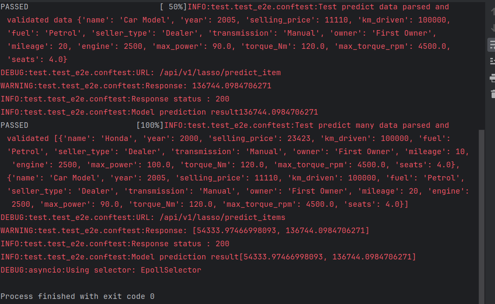
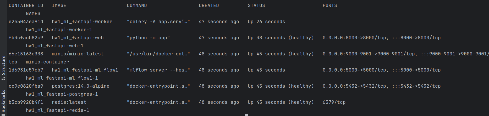

## Исследования и описание работы над моделью

Выводы по ноутбуку: [readme](research/dock.md)

## Запуск приложения

### Development

Для запуска приложения в среде разработки доступны варианты запуска напрямую через `python` и
через `docker-compose`. Оба варианта используют для конфигурации переменные окружения, которые
описаны в файле `app/settings/settings.py`. В данных режимах запуска доступно обновление кода приложения
на лету, без перезапуска (кроме случаев добавления новых зависимостей).

#### Python Runner

```bash
python -m app
```

#### Docker runner

Перед запуском docker-compose необходимо :

```bash
make build
```

Команда создаст .env из .env.example и сделает "билд" контейнеров.

```bash
docker-compose up -d
```

### Разработка

"Линтинг" проекта :

```bash
make lint 
```

### Зависимости

Управлением зависимостями занимается утилита `poetry`. \
Перечень зависимостей находится в файле `pyproject.toml`. \
Инструкция по настройке poetry-окружения для
pyCharm [здесь](https://www.jetbrains.com/help/pycharm/poetry.html).

Для добавления зависимости достаточно написать `poetry add requests`, утилита сама подберёт версию,
не конфликтующую с текущими зависимостями. \
Зависимости с точными версиями фиксируются в файл `poetry.lock`. \
Для получения дерева зависимостей можно воспользоваться командой `poetry show --tree`. Остальные
команды доступны в официальной документации к утилите.

### Тестирование

Тесты оформлены в виде полностью независимого решения, Тесты требуют. Для запуска тестирования достаточно вызвать в
корне проекта команду.

```bash
make test
```

## Важно!

На данный момент сервис не работает с локальными моделями. Модели должны быть загружены на S3 с помощью Mlflow.
Путь до модели указывается в переменных окружения описанных в `app/settings/settings.py` .
В сервисе использованы кастомные валидаторы полей Pydantic в `app/serializers/car_model.py` .

# Скриншот успешно пройденных сквозных тестов




