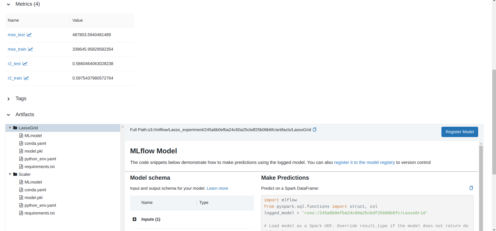

## Описание проделанной работы

# Предобработка данных:

Обеспечил идемпотеность данных на train, удалил нечисловые значения.  
Переменная torque была преобразована в torque и max_torque с учетом единиц измерения
(тестировал с преобразованием и без). Преобразование не дало существенный результат.
Признаки mileage, engine, max_power и torque "починены" и приведены к нормальному значению.
Числовые признаки были обработаны StandardScaler, а строчные OneHotEncoder.
Переменной engine был присвоен целочисленный тип данных.

# EDA

Выяснил что во многих признаках есть выбросы убрав которые можно улучшить модели.
Признак Max power имеет высокую корреляцию с целевой переменной.
Признак max_power слабо положительно скоррелирован с годом выпуска авто
Признаки max_power и engine с корреляцией в 0.68, а также seats и engine с корреляцией в 0.65
Признак year и целевая переменная могут иметь квадратичную зависимость

# Построение моделей

Исследовал Были исследованы следующие линейные модели: Линейная регрессия без регуляризации,
а также с L1, L2 резуляризациями,
С совмещением L1, L2 (ElasticNet).
В результате кроссвалидации и подбора гиперапараметров выяснил что все обученные модели имеют схожую метрику и
не получается выделить определенную модель.
Привожу в пример метрики регрессии Lasso :

Наилучшие параметры: {'alpha': 10000}
Lasso-регрессия с оптимальными параметрами:
R^2 трейн: 0.5975
MSE трейн: 339645.9583
R^2 тест: 0.5860
MSE тест: 487803.5940

# Бизнес метрика

Доля результата в районе 10% во всех моделях равна 24%

# Сохранение моделей

Для сохранения моделей и метрик использовал Mlflow.
Сохранял как локально так и на поднятый minio S3

